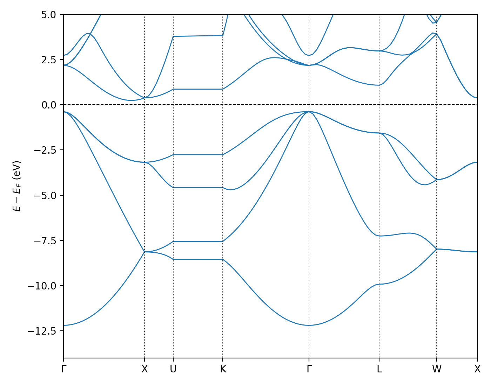

==========================================================
Tutorial 3: Setting up Calculations with Spin and k-points
==========================================================

:Author: Nicholas Hine, Chengcheng Xiao
:Date: July 2026

Setting up Spin-Polarised Calculations
^^^^^^^^^^^^^^^^^^^^^^^^^^^^^^^^^^^^^^

TBD

Setting up calculations with k-points
^^^^^^^^^^^^^^^^^^^^^^^^^^^^^^^^^^^^^

By default ONETEP assumes the system is periodic but that the simulation cell is
large enough that k-point sampling is not required. However, ONETEP does support
k-point sampling of the Brillouin zone. By utilising the k-point sampling
technique, the periodicity of the system can be exploited to reduce the
computational cost of the calculation and small systems (from unit cells
upwards) can be efficiently simulated.

ONETEP has two modes for k-point sampling the Brillouin zone: the Plane wave
mode and the Tight-binding mode. The underlying theory for these two modes is
described in the `documentation
<https://docs.onetep.org/kpoints_and_spin.html>`_. In order to launch a
calculation with k-points sampling, the user must first choose between these
modes as appropriate to the periodicity of their system, and then specify a grid
of k-points on which the calculation is to be performed.

Here, taking FCC silicon as an example, we will show how to set up a calculation
with k-points. The full input can be found in the file :download:`Si.dat
<_static/tutorial_3/Si.dat>`.

Focusing on the input file, there are a few important keywords that are required
for k-point sampled calculation. First, for k-point sampling, NGWFs need to be
complex. This is done by:

::

   use_cmplx_ngwfs : T

Depending on your system sizes, choose the better k-point method for your
calculation (PW/TB). Here we use PW method for FCC silicon, which is set by

::

   kpoint_method : PW 

Depending on your set up you would like to set your NGWFs to be (selective)
extended. Note that only PW mode can and should be used when extended NGWFs are
used, TB mode does not support extended NGWFs. Here we set the NGWFs to be fully
extended along three directions

::

   extend_ngwf : T T T

To set up k-point grid you have two choices: either use automatic k-point
sampling scheme as

::

   kpoint_grid_shift : 1 1 1 
   kpoint_grid_size : 6 6 6

where :code:`kpoint_grid_size` is the number of k-points in each direction, and
:code:`kpoint_grid_shift` is the shift of the grid. Optionally, one can use
:code:`kpoint_gamma_centred` to force a gamma-centred grid. By default, ONETEP
will use a Monkhorst-Pack grid.

Alternatively, you can tell ONETEP explicitly the k-point grid you want to use by
providing a list of k-points and their weights. This is done by

::

   %block kpoints_list 
   x y z weight 
   ... 
   %endblock kpoints_list

It is usually a good idea to use kpar parallelization where certain number of
ONETEP instances (termed kpars) are launched together to perform the calculation
for a subset of k-points. The number of kpars is set by

::

   num_kpars : 4

If kpar is used, the full output of each kpar will only be printed out if
:code:`output_detail` is set to be higher than :code:`Normal` (i.e.,
:code:`Verbose`, :code:`Prolix` or :code:`MAXIMUM`). Otherwise, only the output
of the first kpar will be printed out.
   

Best practices 
---------------

It is usually a good idea to initialise the calculation with linear combination
of atomic orbitals in reciprocal space

::

   pub_ngwfs_init_recip : T

If you are using EDFT, it is usually a good idea to use

::

   eigensolver_abstol : -1 
   eigensolver_orfac : -1 
   occ_mix : 1.0

A lot of times it is also a good idea to run direct full matrix inversion rather
than the Hotelling method:

::

   maxit_hotelling : 0

Band structure calculations 
---------------------------

Right now ONETEP does not support full band structure calculations with k-point
sampling using non-self-consistent calculations. However, it is possible to
perform a "fake-kpoints" band structure calculation by appending the k-point
path to the end of the k-point grid, and set the k-point weights to be zero for
the k-points along the path.

A python script is provided in the :download:`kp_gen.py
<_static/tutorial_3/kp_gen.py>` (requires `seekpath` and `ase`) to generate the
k-point path for a given :code:`.dat` input file. 

::

   python kp_gen.py -c seedname.dat -v -r 0.05 --hybrid 

The output file :code:`KPOINTS.k_path` contains the k-point path for the band
structure calculation and the label of high-symmetry points which can be added
to the :code:`.dat` ONETEP input file.

For example, the band structure of FCC silicon can be calculated by input file
:download:`Si_band.dat <_static/tutorial_3/Si_band.dat>`. Where the eigenvalues
are printed out by the properties module (i.e., :code:`do_properties : T`). The
results are written in the file :file:`Si_band.dat.val_bands` which has the same
format as the output of :code:`.bands` file in a standard CASTEP calculation.

The resulting band structure can be plotted using the script
:download:`plot_bands.py <_static/tutorial_3/plot_bands.py>` (requires `ase`)
via

::

   python3 plot_bands.py Si_band.dat Si_band0.val_bands -o bands.png --emin=-14 --emax=5

And the resulting band structure is shown in the figure below.

.. _Figure fig:T3_1:

   Band structure of FCC silicon calculated using ONETEP with k-point sampling.

Input files
^^^^^^^^^^^

Files for this tutorial:

 - :download:`Si.dat <_static/tutorial_3/Si.dat>`
 - :download:`Si_band.dat <_static/tutorial_3/Si_band.dat>`
 - :download:`Si_NCP19_PBE_OTF.usp <_static/tutorial_3/Si_NCP19_PBE_OTF.usp>`
 - :download:`kp_gen.py <_static/tutorial_3/kp_gen.py>`
 - :download:`plot_bands.py <_static/tutorial_3/plot_bands.py>`

